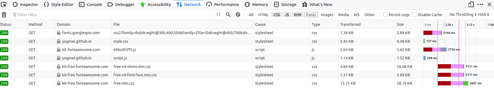

# Javascript III

## Métodos de Array

;

**Principais Métodos**
* [**concat**](https://developer.mozilla.org/en-US/docs/Web/JavaScript/Reference/Global_Objects/Array/concat) faz cópia simples do Array e adiciona os argumentos 
* [**join**](https://developer.mozilla.org/en-US/docs/Web/JavaScript/Reference/Global_Objects/Array/join) cria um string do Array. Adiciona o argumento como cola entre cada membro do Array. 
* [**shift**](https://developer.mozilla.org/en-US/docs/Web/JavaScript/Reference/Global_Objects/Array/shift) remove e retorna o primeiro elemento 
* [**pop**](https://developer.mozilla.org/en-US/docs/Web/JavaScript/Reference/Global_Objects/Array/pop) remove e retorna o ultimo elemento 
* [**unshift**](https://developer.mozilla.org/en-US/docs/Web/JavaScript/Reference/Global_Objects/Array/unshift) anexa os argumentos na frente do Array  
* [**push**](https://developer.mozilla.org/en-US/docs/Web/JavaScript/Reference/Global_Objects/Array/push) anexa os argumentos no final do Array  
* [**reverse**](https://developer.mozilla.org/en-US/docs/Web/JavaScript/Reference/Global_Objects/Array/reverse) inverte o Array sem copiá-lo 
* [**slice**](https://developer.mozilla.org/en-US/docs/Web/JavaScript/Reference/Global_Objects/Array/slice) faz cópia simples da porção do Array delimitada por argumentos do índice 
* [**splice**](https://developer.mozilla.org/en-US/docs/Web/JavaScript/Reference/Global_Objects/Array/splice) remove elementos especificados do Array, e os substitui com argumentos adicionais opcionais 
* ** [**sort**](https://developer.mozilla.org/en-US/docs/Web/JavaScript/Reference/Global_Objects/Array/sort) classifica o Array sem copiá-lo, opcionalmente usando um argumento comparador 
* [**toString**](https://developer.mozilla.org/en-US/docs/Web/JavaScript/Reference/Global_Objects/Array/toString) chama join sem passar um argumento
* [**indexOf**](https://developer.mozilla.org/en-US/docs/Web/JavaScript/Reference/Global_Objects/Array/indexOf) retorna o primeiro elemento igual ao valor especificado, ou -1 *se nenhum for encontrado 
* [**lastIndexOf**](https://developer.mozilla.org/en-US/docs/Web/JavaScript/Reference/Global_Objects/Array/lastIndexOf) retorna o último elemento igual ao valor especificado, ou -1 se nenhum for encontrado 
* ** [**forEach**](https://developer.mozilla.org/en-US/docs/Web/JavaScript/Reference/Global_Objects/Array/forEach) aplica a função fornecida para todos elementos do Array
* ** [**map**](https://developer.mozilla.org/en-US/docs/Web/JavaScript/Reference/Global_Objects/Array/map) cria um novo Array contendo os resultados da aplicação da função a todos elementos do Array 
* ** [**filter**](https://developer.mozilla.org/en-US/docs/Web/JavaScript/Reference/Global_Objects/Array/filter) cria um novo Array contendo todos os elementos para os quais a função fornecida retorna verdadeiro 
* ** [**reduce**](https://developer.mozilla.org/en-US/docs/Web/JavaScript/Reference/Global_Objects/Array/lastIndexOf) aplica uma função simultaneamente para dois valores do Array (da esquerda para a direita) de forma a reduzi-los a um valor único
* [**some**](https://developer.mozilla.org/en-US/docs/Web/JavaScript/Reference/Global_Objects/Array/some) Checa se pelo menos um dos elementos do array obedece a condição passada pela função
* [**every**](https://developer.mozilla.org/en-US/docs/Web/JavaScript/Reference/Global_Objects/Array/every) Checa se todos os elementos do array obedecem a condição passada pela função 

-----------

## Protocolo HTTP
- [Uma visão geral do HTTP](https://developer.mozilla.org/pt-BR/docs/Web/HTTP/Overview);

HTTP é um protocolo que faz a conexão entre um receptor, normalmente o navegador (_browser_) e um servidor. Ela é a base da transferência de dados na Web.

Quando um site é acessado, seu navegador envia uma solicitação (_request_) para o servidor onde ele está hospedado. Este, por sua vez, envia uma resposta (_respose_) com o resultado dessa solicitação.


Por exemplo, ao chamar um script, uma folha de estilo ou uma imagem, é feita uma requisição para cada um desses recursos.



### Anatomia de uma Requisição HTTP


- Método HTTP, verbo como GET, POST, PUT, DELETE. As requisições para pegar e mostrar dados normalmente são feitas através de GET. Os demais verbos podem ser usados para modificar dados do servidor ou banco de dados;
- Origem e porta da requisição e caminho do arquivo solicitado;
- Versão do protocolo HTTP;
- Cabeçalhos (_header_) com informações para os servidor;
- Corpo (_body_) que são necessários para algumas requisições POST.

### Anatomia de uma Resposta HTTP


- Versão do protocolo HTTP que o servidor segue;
- Código de status (veja referências abaixo);
- Cabeçalhos (_header_) com informações vindas do servidor;
- Corpo (_body_) com dados solicitados, se houver.

**Código de Status das Respostas**
- [HTTP Statuses](https://httpstatuses.com/)
- [HTTP Dogs](https://httpstatusdogs.com/)
- [HTTP Cats](https://http.cat/)

----------------

## API
- [Open APIs](https://github.com/public-apis/public-apis);
- [What is an API? [Vídeo em inglês]](https://www.youtube.com/watch?v=s7wmiS2mSXY);
- [O que significa API e como ela funciona](https://www.redhat.com/pt-br/topics/api/what-are-application-programming-interfaces)

API é a abreviação de _Application Programming Interface_, ou em português, Interface de Programação de Aplicativos. Trata-se de uma interface de comunicação e integração entre aplicações.

Por exemplo, para usar dados do Maps, o Google desenvolveu uma API para ser consumida entre desenvolvedoras.

Cada API possui uma documentação e modo de comunicação, quais informações (headers e body) enviar para a API para conseguir ter acesso a seus dados. Algumas delas permitem que seja feita alteração de dados e não somente consulta.

Alguns verbos, métodos, que são usados:

Método | O que faz        | Status de retorno |
-------|------------------|-------------------|
GET    | Traz informações | 200               |
POST   | Cria um novo item| 201               |
PUT    | Atualiza um item | 200               |
DELETE | Remove um item   | 200               |

- [O que é REST API](https://rockcontent.com/blog/rest-api/);
- [RESTful API (REST API) - inglês](https://searchapparchitecture.techtarget.com/definition/RESTful-API);

É possível também se deparar com a nomenclatura **REST API**. É uma abreviação para _Representational State Transfer_, ou em português, Transferência de Estado Representacional.

Trata-se de uma arquitetura em que uma API é construída, seguindo determinadas práticas, usando os verbos existentes do protocolo HTTP. É como se fosse um método BEM para APIs. É possível fazer um estilo CSS sem seguir o método, mas pode ser vire uma bagunça e não seja intuitivo. A arquitetura REST API faz com que o consumo das APIs sejam mais intutivos e organizados.


### Acessando dados de APIs
- [JSON Placeholder](https://jsonplaceholder.typicode.com/guide.html);

Para acessar uma API, via de regra, basta acessarmos sua URL em um navegador. Ela nos retorna o dado designado a esse caminho, normalmente um JSON.

Acessando a partir do navegador, estamos fazendo uma requisição `GET`. Para fazer requisição com outros verbos (`POST`, por exemplo), temos que usar outras ferramentas. Veja a seção Requisições.

### O que é CORS?

- [Cross-Origin Resource Sharing (CORS)](https://developer.mozilla.org/pt-BR/docs/Web/HTTP/Controle_Acesso_CORS);
- [3 Ways to Fix the CORS Error - artigo em inglês](https://medium.com/@dtkatz/3-ways-to-fix-the-cors-error-and-how-access-control-allow-origin-works-d97d55946d9);

Quando se faz uma requisição para um recurso externo, por padrão, o cliente (navegador) bloqueia se as origens são diferentes. O servidor deve, então, permitir o acesso de origens distintas. O CORS, ou Compartilhamento de Recursos de Origem Diferente, vem como mecanismo para permitir o acesso desses recursos.

Não são todos os recursos que necessitam de CORS. Alguns exemplos:
- Requisições com `XMLHttpRequest` e `fetch`;
- Fontes web.

É importante notar que é um problema que deve ser resolvido no lado do **servidor**.

----------------

## JSON
JSON é a abreviação de JavaScript Object Notation ou Notação de Objeto Javascript. É uma sintaxe para armazenar e tranferir dados. Trata-se de uma **string** que se parece bastante com um **objeto** Javascript.

```json
[
  {
    "nome": "Mellina",
    "idade": 21,
    "profissão": "desenvolvedora"
  },
  {
    "nome": "Joana",
    "idade": 12,
    "profissão": "criança"
  }
]
```

Nota-se que as propriedades, no JSON, necessariamente tem que estar entre `""`.

### JSON.parse(data)
- [JSON.parse()](https://developer.mozilla.org/en-US/docs/Web/JavaScript/Reference/Global_Objects/JSON/parse);

O método `JSON.parse(data)` transforma a `data` string do JSON em um objeto Javascript para ser manipulado e o retorna.

```javascript
const parsedData = JSON.parse(data);
```

----------------

## Requisições
## XMLHttpRequest

- [XMLHttpRequest](https://developer.mozilla.org/en-US/docs/Web/API/XMLHttpRequest);

XMLHttpRequest (XHR) é um objeto que são usados para interagir com servidores. São usados para receber dados de uma URL sem ter que atualizar de novo a página - é criado uma requisição assíncrona.

Apesar de ter "XML" no seu nome, a requisição de `XMLHttpRequest` pode receber qualquer tipo de dado. 

### Anatomia de uma requisição XMLHttpRequest

```javascript
// cria um novo construtor XMLHttpRequest
const request = new XMLHttpRequest();
const metodo = "GET";
const url = "https://exemplo.com";

// inicializa a requisição
request.open(metodo, url, true);

// adiciona um evento para ser ativado quando o readyState mudar
request.addEventListener("readystatechange", function () {
  // verifica se a conexão foi bem sucedida
  if (request.readyState == 4 && request.status == 200) {
    // atribui a uma nova variável o JSON já transformado em objeto Javascript (através do parse())
    const data = JSON.parse(request.response);
  }
})

// envia a requisição para o servidor
request.send();
```

### Promises

- [Promises](https://developer.mozilla.org/pt-BR/docs/Web/JavaScript/Reference/Global_Objects/Promise);
- [Usando Promises](https://developer.mozilla.org/pt-BR/docs/Web/JavaScript/Guide/Usando_promises);
- [Callback Hell to Async and Await - artigo em inglês](https://blog.hellojs.org/asynchronous-javascript-from-callback-hell-to-async-and-await-9b9ceb63c8e8);

Promise é um objeto que representa o sucesso ou fracasso de uma operação **assíncrona**. Elas são bastante usadas dentro de outras estruturas apresentadas no ES6.

#### Anatomia de Promise

- [Promise() constructor](https://developer.mozilla.org/en-US/docs/Web/JavaScript/Reference/Global_Objects/Promise/Promise);

Para criar uma nova Promise, é necessário usar a palavra-chave `new`. Existe um construtor nativo e ele retorna o objeto `Promise`.

O callback (executor) da `Promise` recebe dois parâmetros: _resolve_ e _reject_. Esses parâmetros são funções geradas pelo construtor

Depois disso, é possível usar os métodos `then()` e `catch()`. Ambos recebem callbacks que são executados quando há uma resolução ou rejeição da `Promise`.

```javascript
const promise = new Promise((resolve, reject) => {
  if (condicao) {
    resolve("resolvido!"); // dado é retornado para o then
  } else {
    reject("aaahh errooou"); // entra no catch
  }
});

promise
  .then((data) => {
    console.log(data);
  })
  .catch((err) => {
    console.log(err);
  });
```